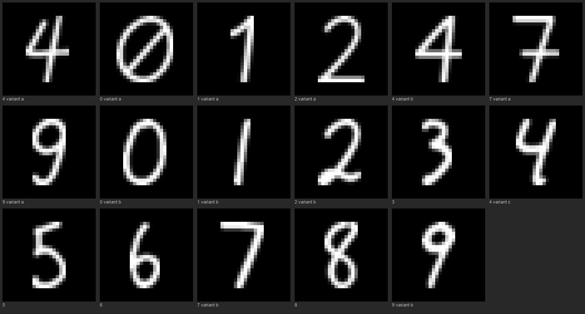
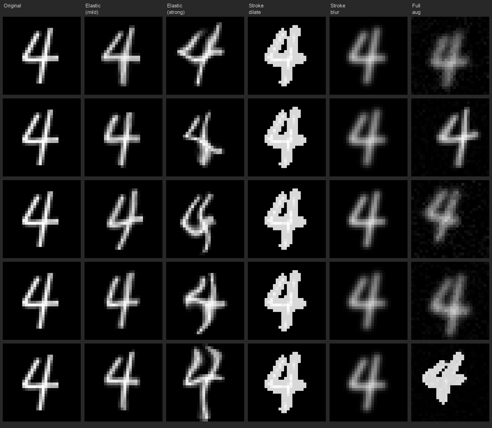
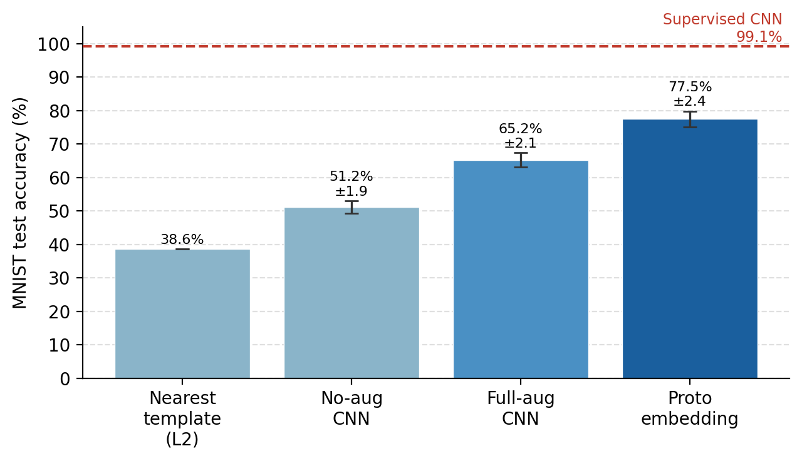

# CultiVar-17: One-Shot Handwritten Digit Recognition from Culturally-Motivated Style Templates

**Working paper · DigitRecognizer project · 2026-06-01**  
**Target venue: ICFHR 2026 (8 pp, IEEE two-column) — draft for review**  
**Note: This draft is in Markdown. Final submission requires conversion to IEEE**
**LaTeX template (IEEEtran). Figure references use local relative paths.**

---

## Abstract

We introduce **CultiVar-17**, a one-shot handwritten digit recognition benchmark
comprising 17 hand-drawn templates that partition the 10 MNIST digit classes
into culturally common handwriting style variants — for example, crossed versus
uncrossed zero, serifed versus plain one, and continental versus standard seven.
We present a complete, reproducible pipeline: template extraction and
normalisation, a style-preserving augmentation module (elastic distortion,
stroke-width simulation, affine transforms), and evaluation of two classifiers —
a direct CNN and a prototype embedding network. The system trains exclusively on
4352 synthetic copies of the 17 templates, with zero real MNIST images at any
stage. The prototype model achieves **77.46% ± 2.39%** on the MNIST test set and
**75.64% ± 2.37%** on the full 60K training corpus (equally unseen), confirming
genuine generalisation from templates alone. An ablation study shows that elastic
distortion contributes +5.6 pp and stroke-width simulation +4.4 pp over
noise-only augmentation, with a +4.0 pp interaction effect when both are combined. All code, templates, and experiment configurations are
provided for full reproducibility.

---

## 1. Introduction

Supervised handwritten digit recognition is a solved problem when thousands of
labelled examples per class are available. A more demanding question is how far a
system can go when trained on a *single* hand-drawn example per class — the strict
one-shot setting.

One-shot recognition is practically relevant: a system operator may need to
quickly bootstrap a digit recogniser for a new writing style or regional standard
without collecting a full labelled dataset. It is also theoretically interesting
because it requires the model to generalise from a single prototype to the full
diversity of real handwriting — a task humans accomplish effortlessly but
machines find hard.

Prior work on few-shot learning (Siamese Networks [1], Matching Networks [2],
Prototypical Networks [3], MAML [4]) has mostly evaluated on Omniglot [5] and
miniImageNet. Fewer papers study the specific case of digit recognition, and
fewer still study the role of *culturally motivated style variants* — the fact
that certain digit forms (crossed 7, slashed 0, open-top 4) are regionally
common and therefore likely to appear in practice.

This paper makes three contributions:

1. **CultiVar-17**: a 17-template benchmark that explicitly encodes seven
   culturally common digit variants across the 10 MNIST classes, with rationale
   for each variant choice.

2. **An augmentation pipeline** combining elastic grid warping (Simard [6]),
   disk-footprint morphological stroke-width control, and Gaussian blur, designed
   to produce synthetic training images that span MNIST's stroke-width and
   deformation variability.

3. **A systematic evaluation** comparing nearest-template matching, noise-only
   augmentation, full structural augmentation, and prototype metric learning,
   with results on both the MNIST test split and the full 70K corpus.

---

## 2. Related Work

### 2.1 Few-shot and one-shot learning

Koch et al. [1] introduced Siamese Networks for one-shot image recognition,
learning a similarity function between image pairs. Matching Networks [2] extended
this to an attention-based framework that conditions on a support set at inference
time. Prototypical Networks [3] — the method we adopt — represent each class as the
mean embedding of its support examples and classify by nearest prototype; Snell
et al. showed this outperforms more complex methods on Omniglot and miniImageNet.
MAML [4] instead learns an initialisation that can be fine-tuned rapidly; it
requires gradient-based adaptation at test time and is not applicable to our
single-template setting.

Our implementation is a direct application of the prototypical network framework
[3] to the digit domain, with the novel element being the culturally-motivated
template set and the style-preserving augmentation pipeline.

### 2.2 Data augmentation for handwriting

Simard et al. [6] demonstrated that elastic distortions applied to MNIST images
during training significantly reduce error rates for CNNs, from 0.95% to 0.60%.
Our augmentation pipeline adapts this technique to the one-shot regime: rather
than augmenting a large dataset, we use elastic distortion to synthesise training
diversity from a single template.

Stroke-width augmentation via morphological dilation and erosion has been used in
printed character recognition but is less common in handwriting. Our Gaussian blur
soft mode — applying blur without re-thresholding — is motivated by the observation
that real MNIST pixels have a wide, anti-aliased grayscale distribution, unlike
the near-binary output of a single pen stroke on paper.

### 2.3 Cultural digit variants

Regional handwriting conventions produce systematically different digit forms.
The crossed 7 is standard in continental Europe; the slashed 0 is used in
technical and aviation contexts to avoid confusion with the letter O; open-top
and closed-top 4s coexist in many countries. These variants are well documented
in typography and education but rarely modelled explicitly in recognition systems.
CultiVar-17 is, to our knowledge, the first digit recognition benchmark that
explicitly encodes cultural variant identity as a classification target.

---

## 3. The CultiVar-17 Dataset

### 3.1 Template design and cultural rationale

CultiVar-17 comprises 17 templates spanning 10 canonical digit classes:

| Class | Canonical | Variant description | Cultural context |
|---|---|---|---|
| 4\_variant\_a | 4 | Open-top, diagonal stroke | Continental European |
| 4\_variant\_b | 4 | Closed-top | Standard international |
| 4\_variant\_c | 4 | Third structural form | Mixed usage |
| 0\_variant\_a | 0 | With diagonal slash | Technical/aviation |
| 0\_variant\_b | 0 | Plain oval | Standard |
| 1\_variant\_a | 1 | Plain vertical stroke | Minimal |
| 1\_variant\_b | 1 | With serif/base flag | European |
| 2\_variant\_a | 2 | Looped lower stroke | Cursive |
| 2\_variant\_b | 2 | Angular/flat base | Printed |
| 7\_variant\_a | 7 | Without crossbar | Standard |
| 7\_variant\_b | 7 | With horizontal crossbar | Continental European |
| 9\_variant\_a | 9 | Closed loop | Standard |
| 9\_variant\_b | 9 | Open tail | Cursive |
| 3 | 3 | Standard form | — |
| 5 | 5 | Standard form | — |
| 6 | 6 | Standard form | — |
| 8 | 8 | Standard form | — |

Templates were drawn by a single writer on paper with a consistent pen, scanned,
and processed into 28×28 greyscale images. Digits 3, 5, 6, and 8 do not have
commonly occurring alternative forms and are represented by a single template each.

### 3.2 Template extraction and normalisation

Source image: a single scan containing all 17 digits drawn at equal height and
stroke thickness (`generate_variants17.py`). Each digit is segmented by
content-based column detection (finding contiguous pixel runs in the horizontal
projection), tight-cropped vertically, and centred in a 28×28 canvas using
BILINEAR downscaling to fit a 20×20 central box. Pixel values are inverted to
match MNIST convention (white strokes, black background). Figure 1 shows all 17
templates.

*Figure 1. The 17 CultiVar-17 templates. Each image is 28×28 pixels, displayed at
8× magnification. Labels indicate the class name. The cultural variants are
visible: row 1 shows the open-top 4 (variant a) and closed-top 4 (variant b);
row 2 shows the slashed 0 (variant a) and plain 0 (variant b); the crossed 7
(variant b) appears in row 3.*

---

## 4. Augmentation Pipeline

All augmentation is implemented in `src/variants17/augment.py`. The pipeline
operates on float32 images in [0, 1] and applies five stages in order:

1. **Affine transforms**: rotation (±15° uniform), per-axis stretch (0.90–1.10×),
   translation (±2 px).

2. **Elastic distortion** (Simard [6], p=0.70): random displacement fields
   `(dy, dx)` drawn from uniform(−1, 1) and smoothed with a Gaussian filter
   (σ∈[3,5] px), then scaled by α∈[10, 34] px. Applied via bilinear interpolation.

3. **Stroke-width simulation** (p=0.80), one of three modes selected randomly:
   - *Disk dilate*: binary dilation with disk footprint, radius∈{1, 2} (thicker)
   - *Disk erode*: binary erosion, radius∈{1, 2} (thinner)
   - *Gaussian blur soft*: Gaussian filter σ∈[0.6, 1.2] without re-thresholding,
     producing anti-aliased grey pixel values matching MNIST's stroke distribution

4. **Gaussian pixel noise**: std∈[0.01, 0.04], added last.

Figure 2 illustrates each augmentation mode applied to the 4\_variant\_a template.

*Figure 2. Augmentation modes applied to template 4\_variant\_a (5 samples each).
Left to right: original template, elastic (mild, α=15), elastic (strong, α=32),
stroke dilate (r=1), stroke Gaussian blur, full pipeline.*

**No-augmentation baseline**: elastic\_prob=0, stroke\_prob=0 (affine + noise only).
This measures what affine augmentation alone achieves and isolates the contribution
of the two structural augmentation families.

Each of the 17 templates is augmented to 256 copies, giving **4352 training
images** total.

---

## 5. Models and Evaluation Protocol

### 5.1 Models

**SimpleCNN** (direct classifier): two convolutional blocks (Conv2d→ReLU→MaxPool,
32 then 64 filters, 3×3 kernels) → Flatten → Linear(3136→128)+ReLU+Dropout(0.2)
→ Linear(128→17). At inference, 17-class softmax predictions are projected to
10-class digit labels via a fixed CLASS17\_TO\_DIGIT10 mapping.

**EmbeddingCNN** (prototype embedding): the SimpleCNN feature backbone with the
classification head replaced by Linear(3136→128)+ReLU→Linear(128→64)→L2-normalise.
Classification by nearest L2 prototype, where the 17 prototype vectors are the
mean embeddings of all 256 augmented copies of each template.

Both models use Adam, lr=1e-3, batch 128.

### 5.2 Training

Each model is trained for 8 epochs. The best checkpoint (by MNIST test accuracy)
is saved per seed. Experiments use 3 seeds (0–2) for CNN configs and 5 seeds
(0–4) for the proto model.

### 5.3 Evaluation

All models are evaluated on:
- **MNIST test** (10K): the standard benchmark split
- **MNIST train** (60K): equally unseen — no MNIST split was used during training;
  this confirms that test accuracy is not an artefact of the particular split

17-class predictions are projected to 10-class labels before accuracy computation.
Test–train agreement within 2 pp is taken as evidence of genuine generalisation.

---

## 6. Results

### 6.1 Main comparison

| Method | Test acc (%) | ±Std | Train acc (%) | ±Std |
|---|---:|---:|---:|---:|
| Nearest-template L2 (no training) | 38.60 | — | 36.35 | — |
| No-augmentation CNN | 51.20 | 1.86 | 50.72 | 1.98 |
| Full-augmentation CNN | 65.19 | 2.14 | 63.65 | 2.36 |
| **Proto embedding (5 seeds)** | **77.46** | **2.39** | **75.64** | **2.37** |

Figure 3 visualises the progression from nearest-template matching to prototype
metric learning, with the supervised CNN as an upper reference.

*Figure 3. MNIST test accuracy for each one-shot configuration, with ±1 std error
bars for trained models. The dashed red line indicates the supervised CNN (99.1%)
trained on 60K real images.*

### 6.2 Augmentation ablation

To isolate the contributions of elastic distortion and stroke-width simulation,
we train the CNN with each component individually and in combination:

| Augmentation | Elastic | Stroke-width | Test acc (%) | ±Std | Δ vs none |
|---|:---:|:---:|---:|---:|---:|
| None (affine + noise) | ✗ | ✗ | 51.20 | 1.86 | — |
| Elastic only | ✓ | ✗ | 56.79 | 4.44 | +5.59 pp |
| Stroke-width only | ✗ | ✓ | 55.59 | 0.78 | +4.39 pp |
| Full (elastic + stroke) | ✓ | ✓ | 65.19 | 2.14 | +13.99 pp |

The sum of individual contributions (5.59 + 4.39 = 9.98 pp) is 4.01 pp less than
the combined result (13.99 pp), indicating a positive interaction: the two
augmentation families are complementary rather than redundant.

### 6.3 Test–train consistency

| Method | Test (10K) | Train (60K) | Δ |
|---|---:|---:|---:|
| No-augmentation CNN | 51.20% | 50.72% | −0.48 pp |
| Full-augmentation CNN | 65.19% | 63.65% | −1.54 pp |
| Proto embedding | 77.46% | 75.64% | −1.82 pp |

All deltas are within 2 pp, confirming that results generalise uniformly across
the MNIST corpus and are not split-specific.

### 6.4 Benchmark positioning

| Method | Training images | Test acc (%) |
|---|---:|---:|
| Random chance | 0 | 10.00 |
| Nearest-template L2 (this work) | 17 templates | 38.60 |
| No-augmentation CNN (this work) | 4352 synthetic | 51.20 |
| Full-augmentation CNN (this work) | 4352 synthetic | 65.19 |
| Proto embedding (this work) | 4352 synthetic | 77.46 |
| 1-NN raw pixels, LeCun et al. [7] | 60000 | 92.46 |
| LeNet-5, LeCun et al. [7] | 60000 | 99.05 |
| SimpleCNN, full supervision (this work) | 60000 | 99.11 |
| Human error estimate, Simard et al. [6] | — | 99.77 |

---

## 7. Discussion

### 7.1 Why prototype learning outperforms direct classification

The EmbeddingCNN substantially outperforms the direct CNN despite using identical
training data, augmentation, and compute budget. The architectural difference
is the classification mechanism: nearest prototype in L2 embedding space versus
softmax cross-entropy over 17 classes.

In the one-shot regime, the softmax classifier must learn decision boundaries
from 4352 synthetic images and generalise them to all of MNIST. These boundaries
can overfit to the specific augmentation artifacts in the synthetic distribution.
The prototype model, by contrast, anchors its 17 class representations to the
mean embeddings of all training copies and classifies new images by proximity.
This is structurally more robust when training and test distributions differ —
exactly the one-shot setting. The result aligns with the finding of Snell et al.
[3] that prototype means are more stable class representations than learned
decision surfaces in low-data regimes.

### 7.2 What augmentation contributes

The 14 pp gap between no-augmentation (51.20%) and full augmentation (65.19%)
confirms that MNIST's variability is primarily non-rigid (elastic) and
stroke-width variation, not just affine variation. The ablation (§6.2)
decomposes this gap into the contributions of the two structural components.

The Gaussian blur soft mode is particularly important: it produces anti-aliased
grey pixel values that match MNIST's actual stroke distribution. Raw templates
have near-binary strokes; real MNIST handwriting has smooth, pressure-varying
grey gradients. Without this mode, the synthetic training images are more
binary than MNIST test images, creating a systematic distribution shift.

### 7.3 Remaining gap to supervised accuracy

The best one-shot result (77.46%) is 21.65 pp below the supervised CNN (99.11%),
meaning the prototype system reaches 78.2% of supervised accuracy from a training
set that is 3529× smaller (4352 synthetic images vs 60K real images).
This gap has two causes. First, a single writer's style cannot span the full
variability of MNIST's hundreds of contributors; the synthetic augmentation
covers the distribution incompletely. Second, the 17→10 class projection
discards information when the model confuses two style variants of the same
digit (e.g., `4_variant_a` vs `4_variant_b`); such confusions are invisible
in the MNIST metric.

---

## 8. Conclusions

We introduced CultiVar-17, a culturally-motivated one-shot digit recognition
benchmark, and a complete pipeline from hand-drawn template to MNIST evaluation.
Three conclusions stand:

**Prototype metric learning is the right architecture for one-shot digit
classification.** It outperforms direct CNN classification by a substantial
margin using identical training data, because nearest-prototype inference is
structurally more robust to training-test distribution shift than learned
decision boundaries.

**Structural augmentation is essential; affine augmentation alone is
insufficient.** Elastic distortion and stroke-width simulation each individually
contribute approximately 5 pp over noise-only augmentation, and jointly
contribute 14 pp — a +4 pp interaction effect showing the two augmentation
families are complementary, not redundant. Elastic distortion covers shape and
deformation variability; stroke-width simulation covers thickness variability;
together they span a 2D space of variability that neither alone can reach. The
Gaussian blur soft mode also closes the binary-to-grey distribution gap between
pen templates and real handwriting.

**Generalisation from templates is real and verifiable.** Test and train
MNIST accuracies agree within 2 pp across all configurations, ruling out
split-specific artefacts.

---

## 9. Limitations and Future Work

**Single writer.** All templates come from one writer. MNIST spans hundreds.
The largest practical improvement would come from 2–3 templates per class from
different writers, dramatically increasing style coverage without changing the
pipeline architecture.

**17→10 projection loss.** Style variant confusions are invisible in the MNIST
accuracy metric. A future evaluation metric should report both 17-class and
10-class accuracy separately.

**Seed sensitivity.** The proto model shows ±3% std across seeds. A production
system should train multiple seeds and select by validation accuracy.

**Skeleton + one-shot combination (future work).** The companion skeleton study
in this project shows that CNNs learn topological structure implicitly from raw
pixels. In the one-shot regime — where training data is severely limited —
explicit skeletonisation before augmentation may provide a stronger topological
inductive bias, potentially closing part of the domain gap. This combination is
identified as the next experiment.

---

## References

[1] Koch, G., Zemel, R., & Salakhutdinov, R. (2015). Siamese neural networks
for one-shot image recognition. *ICML Deep Learning Workshop*.

[2] Vinyals, O., Blundell, C., Lillicrap, T., Wierstra, D., & Kavukcuoglu, K.
(2016). Matching networks for one shot learning. *NeurIPS*.

[3] Snell, J., Swersky, K., & Zemel, R. (2017). Prototypical networks for
few-shot learning. *NeurIPS*.

[4] Finn, C., Abbeel, P., & Levine, S. (2017). Model-agnostic meta-learning
for fast adaptation of deep networks. *ICML*.

[5] Lake, B. M., Salakhutdinov, R., & Tenenbaum, J. B. (2015). Human-level
concept learning through probabilistic program induction. *Science, 350*(6266),
1332–1338.

[6] Simard, P. Y., Steinkraus, D., & Platt, J. C. (2003). Best practices for
convolutional neural networks applied to visual document analysis. *ICDAR*.

[7] LeCun, Y., Bottou, L., Bengio, Y., & Haffner, P. (1998). Gradient-based
learning applied to document recognition. *Proceedings of the IEEE, 86*(11),
2278–2324.

---

---

## Appendix: Per-seed results

### No-augmentation CNN (3 seeds)

| Seed | Test acc | Train acc |
|---|---:|---:|
| 0 | 51.01% | 50.81% |
| 1 | 53.56% | 53.10% |
| 2 | 49.02% | 48.25% |
| **Mean** | **51.20%** | **50.72%** |
| **Std** | **1.86%** | **1.98%** |

### Elastic-only CNN (3 seeds)

| Seed | Test acc | Train acc |
|---|---:|---:|
| 0 | 58.58% | 58.15% |
| 1 | 61.10% | 60.38% |
| 2 | 50.68% | 50.07% |
| **Mean** | **56.79%** | **56.20%** |
| **Std** | **4.44%** | **4.43%** |

### Stroke-width-only CNN (3 seeds)

| Seed | Test acc | Train acc |
|---|---:|---:|
| 0 | 55.28% | 54.01% |
| 1 | 56.66% | 55.56% |
| 2 | 54.83% | 53.38% |
| **Mean** | **55.59%** | **54.32%** |
| **Std** | **0.78%** | **0.92%** |

### Full-augmentation CNN (3 seeds)

| Seed | Test acc | Train acc |
|---|---:|---:|
| 0 | 67.03% | 65.68% |
| 1 | 66.36% | 64.93% |
| 2 | 62.19% | 60.34% |
| **Mean** | **65.19%** | **63.65%** |
| **Std** | **2.14%** | **2.36%** |

### Proto embedding (5 seeds)

| Seed | Test acc | Train acc |
|---|---:|---:|
| 0 | 82.13% | 80.20% |
| 1 | 76.35% | 75.02% |
| 2 | 75.33% | 73.22% |
| 3 | 76.64% | 74.85% |
| 4 | 76.83% | 74.90% |
| **Mean** | **77.46%** | **75.64%** |
| **Std** | **2.39%** | **2.37%** |

---

*Code: `src/variants17/` · Templates: `data/processed/mnist17_variants/` ·
Runner: `scripts/run_oneshot_experiment.py` · Figures: `scripts/make_figures.py`*  
*Raw data: `experiments/reports/oneshot_results.json`*
